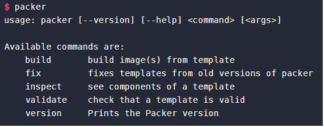

# IAC - Packer


Packer is another Infrastructure as Code tool, which we can use to create an image of a environment. It is very useful when scaling up our infrastructure, as it is far quicker to create environments with a saved image, instead of provisioning each new environment.

## Seting up Packer
- If on linux, you can use the following commands:
- Add the key
```shell
curl -fsSL https://apt.releases.hashicorp.com/gpg | sudo apt-key add -
```
- Add the repository
```shell
sudo apt-add-repository "deb [arch=amd64] https://apt.releases.hashicorp.com $(lsb_release -cs) main"
```
- Update and install
```bash
sudo apt-get update && sudo apt-get install packer
```
- Check packer has downloaded by using the command `packer`


## Creating a packer file
Packer works with jazon format which is essentially a dictionary. 